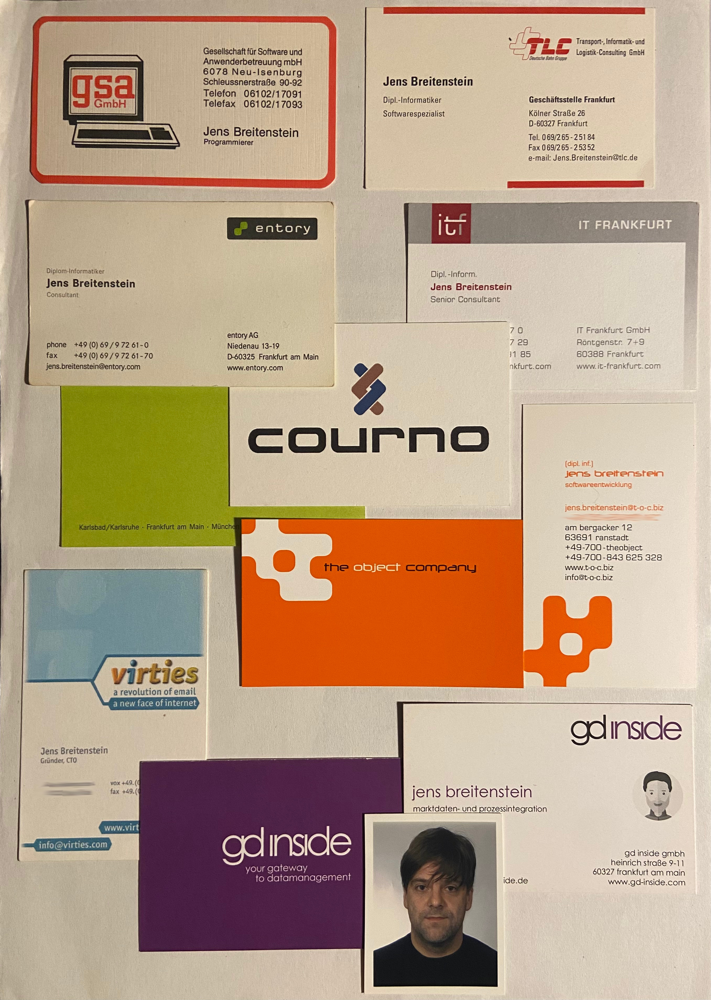

Welcome to my blog — a behind-the-scenes journey into the development of both hardware and software for a modern pedal
board.

## About me (past)

Hi, I’m Jens — a software developer with over 30 years of hands-on experience across industries like finance, 
transportation, healthcare, high-performance trading, and ecommerce. 
My journey started in the 1980s with a Commodore PET 2001, followed by an Apple IIe — and it was love at first byte. 
Since then, software (and often hardware) has been more than just a job. It’s been my passion and playground.

----

`1990`
I began with DBase and Clipper, and nearly had my macro-based menu system published in the Nantucket Magazine 
(before the company disappeared — sigh). Back then, we were building data warehouses on 80×45 character terminals, 
linking two machines with Token Ring networks, and wrestling daily with matrix printers.

In `1997`, I worked on digitizing the Frankfurt Book Fair, building a cross-platform UI for Mac and PC long before Java 
was viable for real production. That led to my first encounter with cross-compiled C++, XVT/XVTDSC, 
and using a compact, blazing-fast read-only database build by my college — years before Elasticsearch existed.

`1999` At Deutsche Bahn, I helped tackle the wildly complex problem of optimal group seating on trains.
- with EJBs on a quad core server! And VisualAge, a tool ahead of it's time until IBM screwed it.

Then came the-object-company, where we developed autonomous warrant trading systems for Dresdner Bank in `2001`, 
with blinking real-time Swing UIs on top of JMS, BEA WebLogic, and EJBs (yes, those EJBs).
- we created connection to ORC, EURONEXT, XETRA/TradeLink
- used all the Java "O"s: OOA, OOD, OOP
- Fought Nightmares like SimpleDateFormat not being thread-safe
- Server and Clientside development

In `2003`, I joined one of the largest projects of my career — building multi-channel banking architectures for Postbank
spanning internal UIs, call-center tools, public websites, and huge middleware systems for credit cards, 
loans, and external credit checks (Schufa, InFoScore - sigh).
Overall we build hugh service layers to combine shadow databases and SAP and introduced configurable process engines 
all in 
- JAVA, EJBs
- some Cobol, BTX
- SAP R3 (Banking) ... and UML

`2006` I started building a custom Swing-based SQL editor for Depfa Bank’s Summit platform, 
automating UI generation from hundreds of database tables to display and edit 1:1, 1:n, n:m relations properly.
- JAVA, Swing, JMS, WebStart(!), JBoss
- Summit

Mid of `2007` I left the finance area and jumped into the startup scene, working with old friends (and new time zones) 
from New Zealand and the Australian outback, long before “remote-first” was a buzzword.
Time drift was horrible, but I loved it and got in touch with people I closely worked together over years, remote 
while they travelled through the outback of Australia, laptop on their knees. That was considerably "hard core remote".
We jumped on the first stable libraries and frameworks like:
- Maven
- Tapestry5
- Spring
- Hibernate, PostgresSql
- iReport

In parallel around `2008`, the shopping clubs sprout like mushrooms from the ground, so did Brands4Friends.
Due to the nature of their marketing, campaign driven model, their servers in canada crashed regularly when they sold
some Gucci Article at 50% discount. At that time the first version of an high-performance Terracotta driven shop  
cluster was up and running after 3 month, written by 3 developers, no more overselling, no more crashed. 
I was responsible for the entire architecture / development of the shop and later integration in the inventory 
management and payment system.
- Wirecard (sigh) for creditcard handling, staged 3d-secure
- Microsoft Navision Backend. 
- Connections to AWS S3 / EC2 
- c#/.net Bridge to Navision
- Terracotta, JMS-via-Terracotta
- Maven, Tapestry 5, Spring, Hibernate, HSQL, MySQL 
- Testframework, Quartz, JMeter, Hyperic, Rest API
- No judgment, but using high-resolution images of Miss Switzerland in Victoria's Secret apparel as our test data may 
  have been our most… motivating QA decision ever. Needless to say, that release was tested more thoroughly than 
  any before it.

We built platforms for:
- fashion-and-you (Suisse)
- brands4friends (Germany)
- Sukar (Dubai)
- clickon (Brazil) 
- grupfoni (Turkey)
- India
- Japan, Australia, Mexico

I also had the great opportunity to work side-by-side with teammates in Switzerland, India, and Brazil — not just remotely, 
but on-site in their offices. Those face-to-face collaborations were deeply rewarding and gave me invaluable insights 
into local work cultures, team dynamics, and what truly makes a global project tick.

Unfortunately, the nature of Jouney's is they end. Hard.
Which brought me back into the financial field.

Around `2011`, I re-entered finance with Deutsche Bank, working on massive credit risk systems — the kind that needed 100+ 
physical servers back then, which you'd spin up on EKS today. Tools like Hazelcast and MongoDB entered the mix 
(honestly, which I don’t love, but know them well enough, though).

And in `2014` it started like it began. In 2014, I joined gd-inside, a small, focused team providing regulatory and 
backend services to financial institutions from Valuation Prices, Arrival Prices or Transaction Cost calculation.
Till today. And now I love to work in fields like
- Apache Camel, JavaScript ChartLibs, JDBC driver based on JSONs, Trick JasperReports, Postgres in Kiosk Mode, 
  MongoDb Audit-trails with Playback and so much more...
- Java, Python, Dart, C++
- Docker, Docker, Docker and RestAPIs in R, Python, Java, C++ (don't ask).
- AI Tools e.g. AWS Textract, AWS NovaLite, ChatGPT API, ChatGPT Agents, Prompts
- Six Financial, WM, FactSet, TTM0, AVS, Bloomberg
- Prometheus, Victoria Metrics, PushGateway, Jmx-Batch-Push, Grafana 

----

## About me (present)

Over time, my development focus naturally evolved. Today, I work heavily with Docker,
advocate for microservice architectures to generate PDFs and various types of charts, and experiment with AI workflows —
from building pipelines for reproducible results to wrestling with ChatGPT agents that answer provider data queries
in plain language. It’s a blend of engineering discipline and creative chaos, and I love both.

Outside of my day job, I’m building a DIY MIDI Music Workstation Pedal board — a modular,
touchscreen-powered music controller. It’s a return to embedded systems, electronics, and low-level programming
mixed with Flutter, C++, Dart, WebSockets, RestAPIs, Docker, and modern component based software architecture.
A passion project fueled by curiosity, solder smoke, and my AI pair programmer: ChatGPT.

## Music!

Even I am on stage you’ll never spot me. I’m that long-haired, old, slightly scruffy guy hiding in the back.
The good news? My Kronos is exactly the right height to perfectly hide my belly. Total win. For all of us.

Sometime you can see parts of me (arm behind a tree, or an eye, some hair)

Under rare occasions I can be spotted on images in my entire gorgeousness (for sure, I have to pay for this)

## Or you spot us outside!

----

## § 5 TMG

### Deutsch

**Impressum**

Angaben gemäß § 5 TMG:

Jens Breitenstein  
Am Beracker 12  
63691 Ranstadt  
Deutschland / Hessen

Kontakt:  
E-Mail: jens@diy-pedalboard.de  
Telefon: +49 123 4567890

Verantwortlich für den Inhalt nach § 18 Abs. 2 MStV:  
Jens Breitenstein (Anschrift wie oben)

Quelle: erstellt mit Hilfe von ChatGPT

**Datenschutzerklärung**

#### 1. Allgemeine Hinweise

Diese Website ist ein privates, nicht-kommerzielles Projekt. Der Schutz Ihrer persönlichen Daten ist uns wichtig. Diese Datenschutzerklärung informiert Sie über die Verarbeitung personenbezogener Daten beim Besuch dieser Website gemäß DSGVO.

#### 2. Verantwortlicher

Jens Breitenstein  
siehe oben  

#### 3. Erhebung und Speicherung personenbezogener Daten

**3.a) Beim Besuch der Website** 
Beim Aufrufen unserer Website werden durch den Hosting-Provider automatisch folgende Daten erfasst und temporär gespeichert:
- IP-Adresse
- Datum und Uhrzeit des Zugriffs
- Browsertyp und -version
- Verwendetes Betriebssystem
- Referrer-URL

Diese Daten dienen ausschließlich technischen und sicherheitsrelevanten Zwecken (z. B. zur Abwehr von Angriffen) und werden nicht zu kommerziellen Zwecken verwendet.

**3.b) Newsletter via MailerLite** 
Wenn Sie sich für den Newsletter anmelden (zzt. noch nicht aktiv), speichern wir Ihre E-Mail-Adresse zum Versand. Dienstleister:
**MailerLite**  
UAB "MailerLite", J. Basanavičiaus 15, Vilnius, Litauen  
[https://www.mailerlite.com](https://www.mailerlite.com)  
Es gelten die Datenschutzbestimmungen von MailerLite. Ihre Daten werden nur mit Ihrer ausdrücklichen Einwilligung gespeichert (Art. 6 Abs. 1 lit. a DSGVO) und können jederzeit widerrufen werden.

**3.c) Kommentare via Cusdis** 
Diese Seite nutzt **Cusdis** für Kommentare. Anbieter: Lightbasenext, Singapur.  
Beim Absenden eines Kommentars werden IP-Adresse und eingegebene Daten über deren Server verarbeitet.  
Datenschutzerklärung: [https://cusdis.com/privacy](https://cusdis.com/privacy)

**4) Rechte der betroffenen Personen** 
Sie haben das Recht auf:
- Auskunft über gespeicherte personenbezogene Daten (Art. 15 DSGVO)
- Berichtigung (Art. 16 DSGVO)
- Löschung (Art. 17 DSGVO)
- Einschränkung der Verarbeitung (Art. 18 DSGVO)
- Widerspruch gegen die Verarbeitung (Art. 21 DSGVO)
- Datenübertragbarkeit (Art. 20 DSGVO)

Bitte wenden Sie sich per E-Mail an: jens@diy-pedalboard.de

**5) Änderung dieser Datenschutzerklärung** 
Diese Erklärung wird bei Änderungen der gesetzlichen Vorschriften oder Dienste aktualisiert.  
Stand: Juli 2025

### English

**Legal Notice**

Information according to § 5 TMG (German Telemedia Act):

Jens Breitenstein  
Am Beracker 12  
63691 Ranstadt  
Germany / Hessen

Contact:  
E-Mail: jens@diy-pedalboard.de  

Responsible for content according to § 18 Abs. 2 MStV (German State Media Treaty):  
Jens Breitenstein (same address as above)

This is a purely private, non-commercial blog project.  
All content is published without any intention of profit.

Source: Created with assistance from ChatGPT (OpenAI)

**Privacy Policy - GDPR Compliant**

#### 1 General Information

This website is a private, non-commercial project. Protecting your personal data is important to us. 
This privacy policy informs you about how personal data is processed when visiting this site, in accordance with 
the EU General Data Protection Regulation (GDPR).

#### 2 Data Controller

See above

#### 3. Collection and Storage of Personal Data

**3.a) When Visiting This Website** 
When you visit this website, certain technical data is automatically collected by the hosting provider and 
temporarily stored in server log files. This includes:
- IP address
- Date and time of access
- Browser type and version
- Operating system
- Referrer URL

This data is used solely for technical and security-related purposes (e.g., protection against attacks) and is not 
used for commercial tracking or profiling.

**3.b) Newsletter via MailerLite** 
If you sign up for the newsletter (currently not active), your email address will be stored and used for sending updates.

Service provider:
MailerLite
UAB "MailerLite", J. Basanavičiaus 15, Vilnius, Lithuania
https://www.mailerlite.com

Your data will only be stored with your explicit consent (Art. 6(1)(a) GDPR) and can be withdrawn at any time.

**3.c) Comments via Cusdis** 
This site uses Cusdis for comments. Provider: Lightbasenext, Singapore.
When you submit a comment, your IP address and comment data are processed through Cusdis servers.
Privacy policy: https://cusdis.com/privacy

**4) Your Rights** 
You have the right to:
- Access information about your stored personal data (Art. 15 GDPR)
- Correct inaccurate data (Art. 16 GDPR)
- Delete your data (Art. 17 GDPR)
- Restrict processing (Art. 18 GDPR)
- Object to data processing (Art. 21 GDPR)
- Receive your data in a portable format (Art. 20 GDPR)
- To exercise your rights, contact: jens@diy-pedalboard.de

**5) Changes to This Privacy Policy** 
This policy may be updated in case of changes in legal requirements or third-party services.

Last updated: July 2025